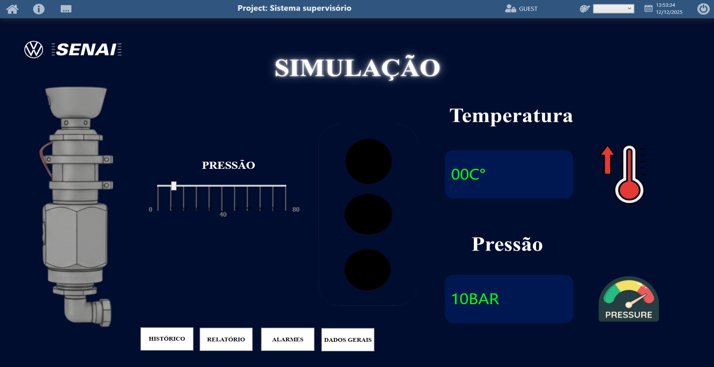

  

# =============================================
# Conteúdo baseado no banner do projeto: 
# "Kit Didático para CLP – Bancada de Pressurização de Massa"
# =============================================

readme = """
# 🔧 Projeto – Kit Didático para CLP  
## Bancada de Pressurização de Massa – Dezembro 2025

Este repositório apresenta o projeto desenvolvido para criação de uma **bancada didática para CLP**, construída a partir de uma solução técnica aplicada ao setor de **bombas de pressurização de massa** da área de pintura (ALA XIII).

O projeto foi desenvolvido pelos aprendizes do Centro de Formeção Profissional Volkswagen, com orientação dos professores e apoio da equipe de manutenção.

---

## 🙌 Agradecimentos aos alunos que disponibizaram o material

**Aprendizes:**  
Ana Luiza Matos Leite  
Davi Ribal Possarli  
Eliezer Oliveira Santos  
Isabella Antunes Ferrareis  
Isadora Alves Pessoa  

---

## 🎯 Objetivo do Projeto

Criar uma solução que elimine problemas recorrentes no sistema de bombeamento de massa na pintura, e transformar essa solução em uma **bancada didática** com:

- Programação básica em CLP  
- Monitoramento de **temperatura**  
- Monitoramento de **pressão**  
- Integração com **IHM**  

---

## 📝 Descrição Geral

O bombeamento da massa de pintura utiliza um sistema pneumático sujeito a falhas críticas, ocasionadas por **superaquecimento** ou **bombeamento nulo**.

Esses problemas envolvem:

### 1️⃣ **Corte da gaxeta**  
Quando a bomba pressuriza acima do ideal:  
- A gaxeta rompe  
- Temperatura da bomba aumenta  
- Pode ocorrer entupimento dos bicos  
- Há polimerização da tinta na tubulação  
- Exige purga com bomba adicional  

### 2️⃣ **Bombeamento nulo**  
Quando o sistema falha em comutar o reservatório:  
- A bomba trabalha sem massa  
- Força excessiva do equipamento  
- Risco de falha completa  
- Necessidade de monitoramento de pressão crítica  

### ✔ Solução Proposta  
- **Anel de suporte com sensor de temperatura** acoplado à bomba  
- Aquece através de **resistência controlada via PWM**  
- Monitoramento via **IHM**  
- **Pressostato** para medir baixa e alta pressão  
- Corte automático da pressurização quando necessário  

---

## 📦 Escopo do Projeto

A solução contempla:

- Desenvolvimento do **hardware de suporte**
- Integração de sensores:
  - Sensor de temperatura
  - Pressostato (baixa/alta pressão)
- Construção da **bancada didática**
- Programação de CLP para:
  - Pressurização
  - Monitoramento
  - Segurança operacional  
- Documentação técnica e pedagógica do sistema  

---

## 🛠 Justificativa

A solução foi criada para:

- Reduzir falhas no setor de pintura  
- Minimizar desperdício de massa  
- Melhorar a eficiência das bombas  
- Reduzir manutenção corretiva emergencial  
- Disponibilizar uma bancada didática realista  
- Permitir que futuros alunos aprendam com um **problema industrial real**  

---

**WE ARE TOGETHER!**
"""

