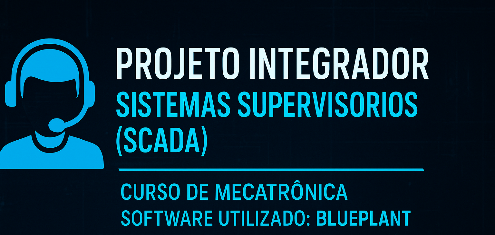

  

# Sistemas-Supervisórios_BluePlant-exemplos

# 🖥️ Projeto Integrador — Sistemas Supervisórios (SCADA/IHM)
## Curso Técnico em Mecatrônica — Centro de Formação Profissional  
### Software Utilizado: **BluePlant**

Este repositório reúne os projetos desenvolvidos pelos alunos do curso Técnico em
**Mecatrônica**, dentro da unidade curricular de **Sistemas Supervisórios (SCADA/IHM)**,
utilizando o software **BluePlant** para criação de interfaces industriais, monitoramento
de processos e simulação de automação.

A atividade foi proposta como um **projeto prático**, permitindo que os estudantes
vivenciassem etapas reais de desenvolvimento de um sistema supervisório industrial.

---

# 🎯 Objetivos da Atividade

A proposta busca desenvolver competências essenciais da área de Mecatrônica:

- Compreender os princípios de sistemas supervisórios (SCADA)  
- Criar interfaces gráficas industriais (IHM)  
- Configurar animações, alarmes, históricos e relatórios  
- Integrar sensores, atuadores e lógicas de processo  
- Aplicar boas práticas de design para ambientes industriais  
- Documentar e apresentar um projeto técnico completo  

---

# 🧰 Conceitos Fundamentais Abordados

### ✔ Interface Homem-Máquina (IHM)
- Navegação entre telas  
- Objetos gráficos  
- Indicadores digitais e analógicos  
- Elementos interativos (botoeiras, setpoints)

### ✔ Supervisão Industrial
- Monitoramento de variáveis  
- Sinalização luminosa  
- Estados de operação  

### ✔ Alarmes Industriais
- Alarmes de nível, falha, emergência  
- Históricos e registro de eventos  
- Codificação por cores (verde/alarme OK, amarelo/atenção, vermelho/crítico)

### ✔ Tendências / Históricos
- Plotagem de variáveis em tempo real  
- Registro sequencial  
- Análise de comportamento do processo

### ✔ Relatórios
- Consolidação de dados  
- Produção diária/mensal  
- Estatísticas do processo

### ✔ Boas práticas de IHM/SCADA
- Padronização visual  
- Hierarquia das telas  
- Organização clara dos objetos  
- Ergonomia e segurança

---

# 🏭 Processos Modelados pelos Alunos

Cada grupo desenvolveu um sistema supervisório completo referente a um processo industrial realista:

### **1. Esteira Transportadora de Peças**  
- Sensor de presença  
- Motor e fluxo animado  
- Contador de peças  
- Alarmes de falha e emergência  

### **2. Estação de Tratamento de Efluentes (ETE)**  
- Tanques com nível  
- Bombas e válvulas  
- Medição de pH  
- Relatórios de qualidade  

### **3. Sistema de Climatização (HVAC)**  
- Três salas climatizadas  
- Temperatura, compressor e fluxo de ar  
- Alarmes de temperatura crítica  
- Tendências de operação  

Cada pasta deste repositório contém:
- Arquivos do projeto BluePlant  
- Imagens das telas  
- Históricos e relatórios  
- Documentação  
- README específico detalhando o processo  

---

# 🏭 Trabalhos disponibilados por alunos

Com base nas aulas de SCADA, em projetos utilizaram um sistema supervisório para o monitoramento.
Aqui se encontre os trabalhos que serão disponibilidos pelos alunos no decorrer do tempo:

### **1. BANCADA DE PRESSURIZAÇÃO DE MASSA - Dez_2025**  

---

# 🧪 Metodologia da Atividade

A atividade foi dividida em etapas:

1. **Estudo do processo industrial**  
2. Identificação de variáveis, sensores e atuadores  
3. **Desenho das telas e navegação**  
4. Inserção de indicadores, animações e botões  
5. **Criação de alarmes**  
6. **Geração de tendências (históricos)**  
7. **Criação de relatórios automáticos**  
8. Teste e validação  
9. Apresentação técnica do projeto  

---

# 🎤 Entrega Final dos Grupos

Cada grupo apresentou:
- Todas as telas funcionando  
- Pelo menos 1 animação e 1 alarme acionado ao vivo  
- Gráficos de tendência  
- Relatório gerado no sistema  
- Explicação da estrutura do projeto  
- Destaques e melhorias implementadas  

---

# 👨‍🏫 Orientação e Supervisão

**Professor Responsável:**  
**Adilson Cunha Rusteiko**  
Robótica Industrial • SCADA • Automação • Python   

---

# ⭐ Finalidade deste Repositório

Este espaço foi criado para:

- Servir como **material de estudo** para futuros alunos  
- Demonstrar boas práticas em desenvolvimento supervisório  
- Compartilhar exemplos reais com a comunidade acadêmica  
- Inspirar projetos técnicos de Mecatrônica e Automação  

Sinta-se à vontade para navegar, estudar e reaproveitar os conceitos para o seu próprio aprendizado!  
