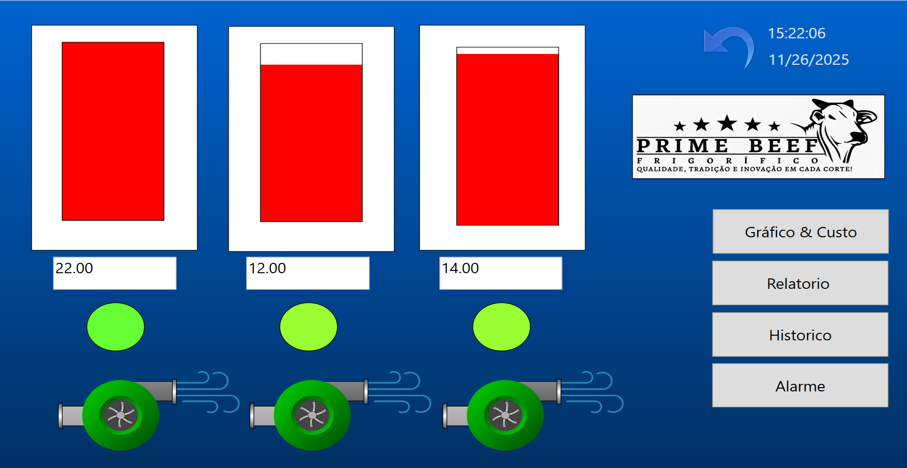

  

# ❄️ Situação 3 — Sistema de Climatização (HVAC)  
Projeto Supervisório no BluePlant

Este projeto apresenta o desenvolvimento de um sistema supervisório para um
**Sistema de Climatização (HVAC)** composto por três salas climatizadas.
O objetivo é monitorar e controlar a temperatura, compressor, fluxo de ar e
parâmetros de conforto térmico, aplicando os principais conceitos de SCADA/IHM.

---

## 🔍 1. Descrição do Processo  
Supervisão completa da temperatura em **três salas** climatizadas, incluindo:

- Leitura de temperatura individual por sala  
- Controle e visualização do compressor  
- Representação do fluxo de ar  
- Sinalização de alarmes e falhas  

### ✔ Recursos obrigatórios implementados

#### **Animações:**
- Indicadores digitais e analógicos de temperatura  
- Compressor ligado/desligado  
- Fluxo de ar com **setas animadas**  
- Sinalizadores luminosos  

#### **Alarmes:**
- Temperatura fora da faixa (alta/baixa)  
- Falha no compressor  
- Sensor de temperatura com defeito  

#### **Históricos:**
- Temperatura de cada sala  
- Tempo total de funcionamento do compressor  

#### **Relatório:**
- Consumo estimado de energia por sala/dia  

---

## 🖥️ 2. Telas do Projeto

O grupo deve criar as seguintes telas:

### 🟦 **Tela Principal**
- Visão geral das 3 salas  
- Indicadores de temperatura  
- Compressor do sistema  
- Fluxo de ar animado  

### 🟩 **Tela de Controle**
- Ações de ligar/desligar compressor  
- Ajuste de parâmetros  
- Botoeiras virtuais  

### 🔴 **Tela de Alarmes**
- Alarmes ativos  
- Histórico de ocorrências  
- Status por cor:
  - Vermelho → Crítico  
  - Amarelo → Atenção  
  - Verde → Normal  

### 📈 **Tela de Históricos / Tendências**
- Curva de temperatura por sala  
- Tempo de operação do compressor  

### 📄 **Tela de Relatórios**
- Consumo estimado por sala  
- Relatório diário/turno/evento  
- Variáveis principais e totais acumulados  

---

## ✔ Itens obrigatórios em todas as telas
- Objetos gráficos **animados**  
- Indicadores digitais e analógicos  
- Botões de comando e navegação  
- Layout industrial organizado e legível  

---

## 🎞️ 3. Animações Obrigatórias
O projeto deve possuir **pelo menos 3 animações**, como:

- Fluxo de ar animado com setas  
- Compressor girando / ligado  
- Indicadores visuais (verde, amarelo, vermelho)  

---

## 🚨 4. Alarmes

Alarmes recomendados:

- Temperatura alta/baixa  
- Compressor falhou  
- Falha no sensor de temperatura  

---

## 📊 5. Históricos / Tendências

Variáveis registradas:

- Temperatura (Sala 1, 2 e 3)  
- Tempo de funcionamento do compressor  

Devem ser apresentados na tela de tendências do BluePlant.

---

## 📝 6. Relatórios
Relatórios devem conter:

- Data e Hora  
- Temperatura média por sala  
- Consumo estimado de energia  
- Totais acumulados  

Tipos possíveis:
- Diário  
- Por turno  
- Por evento  

---

## 📦 7. Conteúdo Desta Pasta

Esta pasta contém:

- 📂 Arquivos do projeto BluePlant  
- 🖼️ Imagens das telas do sistema  
- 🎥 Vídeos demonstrativos (se houver)  
- 📄 Relatórios produzidos  
- 📝 Documentação complementar  

---

## 🎤 8. Entrega Final (Regras da Atividade)

O grupo deverá entregar:

1. Projeto funcional no BluePlant  
2. Apresentação (5–10 minutos) contendo:  
   - Demonstração das telas  
   - Ocorrência de pelo menos 1 alarme  
   - Exibição dos gráficos de tendência  
   - Geração do relatório  
   - Estrutura de telas criada  
   - Explicação das funcionalidades implementadas  

---

## 🤖 9. Utilização de IA

Permitido usar IA para:
- Propostas de telas  
- Efeitos visuais  
- Ícones  
- Suporte na documentação  

---

## 👨‍🏫 Professor Responsável  
**Adilson Cunha Rusteiko**  
Professor de Automação, SCADA, Robótica Industrial e Python  
CFP Volkswagen e Centro Universitário FIAP

