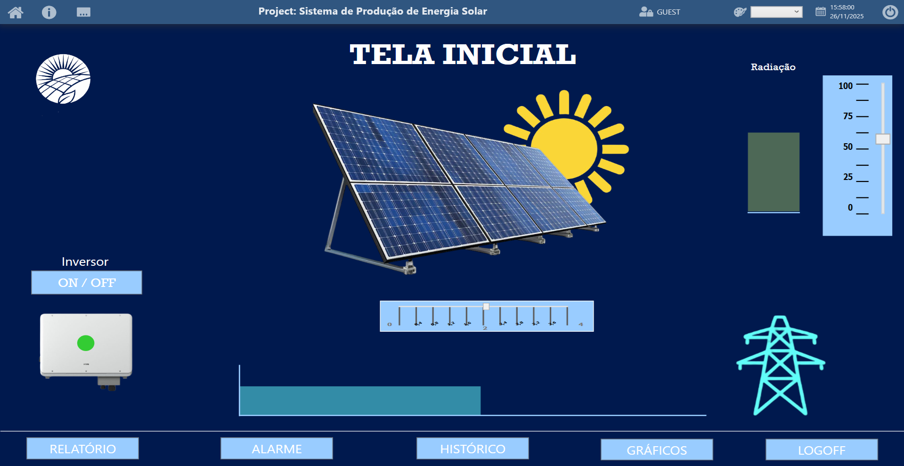

  

# ☀️ Situação 4 — Sistema de Produção de Energia Solar  
Projeto Supervisório em BluePlant

Este projeto apresenta o desenvolvimento de um sistema supervisório completo para o
monitoramento de um **Sistema de Produção de Energia Solar**, utilizando o software **BluePlant**.

Ele foi desenvolvido como atividade prática para consolidar os conceitos de:
- Telas de navegação
- Animações industriais
- Alarmes
- Tendências / Históricos
- Relatórios automáticos
- Boas práticas de IHM/SCADA

---

## 🔍 1. Descrição do Processo

O sistema simula uma planta de geração de energia solar composta por:
- Painéis solares  
- Sensor de radiação  
- Inversor de energia  
- Medição de potência instantânea  
- Cálculo de energia acumulada  

### ✔ Recursos obrigatórios implementados
- **Animações:**
  - Painéis solares com indicador de radiação
  - Inversor ligado/desligado
  - Fluxo de energia indo para a rede

- **Alarmes:**
  - Inversor em falha
  - Potência abaixo da esperada
  - Sensor solar com defeito

- **Históricos:**
  - Potência gerada em tempo real
  - Energia acumulada durante o dia

- **Relatório:**
  - Energia total gerada no mês
  - Comparação diária

---

## 🖥️ 2. Telas do Projeto

O grupo desenvolveu as seguintes telas:

### 🟦 **Tela Principal**
- Visão geral do sistema
- Indicadores principais
- Status do inversor
- Fluxo de energia

### 🟩 **Tela de Controle**
- Botoeiras virtuais
- Comandos para ligar/desligar subsistemas
- Visualização de estados

### 🔴 **Tela de Alarmes**
- Lista de alarmes ativos e históricos
- Indicação visual (verde / amarelo / vermelho)

### 📈 **Tela de Históricos**
- Tendências de potência
- Tendências de energia acumulada

### 📄 **Tela de Relatórios**
- Geração de relatório diário/mensal
- Registro de variáveis principais

### ✔ Itens obrigatórios nas telas
- Objetos gráficos animados  
- Indicadores digitais e analógicos  
- Botões de navegação e comandos  
- Layout limpo, organizado e padronizado  

---

## 🎞️ 3. Animações

O projeto inclui ao menos **3 elementos animados**, tais como:
- Painéis solares reagindo à radiação
- Fluxo de energia para o inversor e para a rede
- Indicadores luminosos (verde, vermelho, amarelo)

---

## 🚨 4. Alarmes

Foram configurados alarmes supervisórios relevantes:
- Sensor solar falho
- Inversor com defeito
- Potência abaixo do mínimo esperado

---

## 📊 5. Históricos / Tendências

Variáveis registradas para análise:
- Potência instantânea
- Energia acumulada

Apresentadas em gráficos de tendência configurados no BluePlant.

---

## 📝 6. Relatórios

Relatórios automáticos contendo:
- Data/Hora do registro
- Variáveis principais do processo
- Energia total acumulada

Tipos:
- Diário  
- Por turno  
- Mensal  

---

## 📦 7. Conteúdo Desta Pasta

Esta pasta contém:
- 📂 Arquivos do projeto BluePlant  
- 🖼️ Imagens das telas  
- 🎥 Vídeos de demonstração (se aplicável)  
- 📄 Relatório gerado  
- 📝 Documentação do grupo  

---

## 🎤 8. Entrega Final (Regras da Atividade)

A entrega do grupo incluiu:
- Projeto funcional no BluePlant  
- Apresentação (5–10 min) contendo:
  - Demonstração das telas
  - Mostra de um alarme ocorrendo
  - Exibição dos gráficos de tendência
  - Geração de relatório
  - Explicação da estrutura do projeto
  - Funcionalidades implementadas

---

## 🤖 9. Utilização de IA

Foi permitida a utilização de ferramentas de IA para:
- Propor layouts de telas
- Criar artes e ícones
- Sugerir melhorias visuais
- Gerar descrições e documentação

---

## 👨‍🏫 Professor Responsável
**Adilson Cunha Rusteiko**  
Professor de Robótica Industrial • SCADA • Python ...  
CFP Volkswagen e Centro Universitário FIAP  

